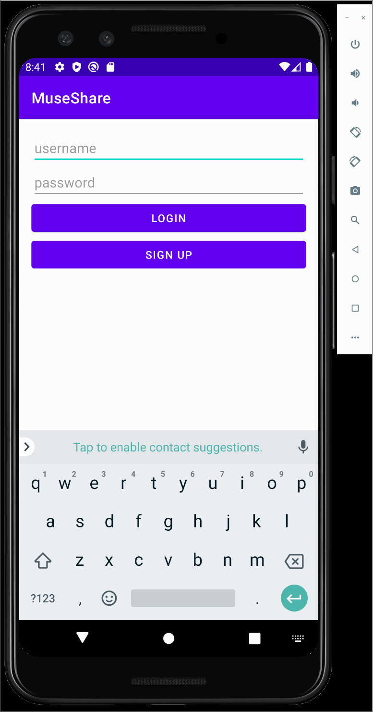
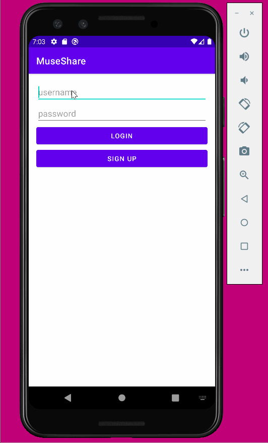

Original App Design Project - README Template
===

# MuseShare

## Table of Contents
1. [Overview](#Overview)
1. [Product Spec](#Product-Spec)
1. [Wireframes](#Wireframes)
2. [Schema](#Schema)

## Overview
### Description
This is an app that lets the user listen and create music playlists and connect with other users by messaging, sharing, and commenting on songs.

### App Evaluation
- **Category:**
  - Social, Entertainment, Music
- **Mobile:**
  - There is social interaction with the users.
- **Story:**
  - Discover and connect with people with same interests. 
  - People can have free sign up and can easily express their thoughts and opinions on music compared to other apps.
- **Market:**
  - This will benefit anyone who enjoys listening to music
- **Habit:**
  - Users may use this app frequently if they choose to. Users can create new playlists or listen to already made playlists.
- **Scope:** 
  - We have defined features that we want to implement and the project will be challenging but not too complex. 

## Product Spec

### 1. User Stories (Required and Optional)

**Required Must-have Stories and Walkthrough Gifs**

- [x] User can login and sign up 

GIF created with [LiceCap](http://www.cockos.com/licecap/).

GIF created with [LiceCap](http://www.cockos.com/licecap/).

- [X] User can log out

GIF created with [LiceCap](http://www.cockos.com/licecap/).

- [ ] navigation bar with Home, Playlist, Messaging

**Optional Nice-to-have Stories**

- [ ] Add a profile tab in navigation bar
- [ ] uploading your own song
- [ ] Show more details about songs
- [ ] Comment on different songs
- [ ] Make specific users as friends to chat with

### 2. Screen Archetypes

* [Login/Sign up Screen]
   * User can login and sign up
   * create or use existing username and password
* [Home Screen]
   *  navigation bar with Home, Playlist, Messaging
   *  list out most recent songs
   * User can log out
* [Playlist Screen]
   *  navigation bar with Home, Playlist, Messaging
   *  list out songs that user likes
* [Messaging Screen]
   *  navigation bar with Home, Playlist, Messaging
   *  chatbox where we can message other users

### 3. Navigation

**Tab Navigation** (Tab to Screen)

* [Home]
* [Playlist]
* [Messaging]

**Flow Navigation** (Screen to Screen)

* [Login/Sign up Screen]
   * [Home Screen ]
   * [Playlist Screen]
   * [Messaging Screen]
* [Home Screen]
   * list of songs with details and comments
* [Playlist Screen]
   * Screen of liked songs by user
* [Messaging Screen]
   * Screen of messages between users

## Wireframes
[Add picture of your hand sketched wireframes in this section]

### [BONUS] Digital Wireframes & Mockups

### [BONUS] Interactive Prototype

## Schema 
[This section will be completed in Unit 9]
### Models
[Add table of models]
| Property | Type | Description |
| --- | --- | --- |
| user | Pointer to user | The users using the app |
| image | File | Image of songs |
| title | String | Title of songs |
| commentsCount | Number | Number of comments that has been posted to a song |
| likesCount | Number | Number of likes for songs and creates playlist |
| createdAt  | DateTime | Date when song is uploaded |
| updatedAt | DateTime | Date when song is last updated |
| songs | File/String/API | The actual songs displayed in app |

### Networking
- [Add list of network requests by screen ]
- [Create basic snippets for each Parse network request]
- Login/Sign Up Screen
  - (Read/GET) Get username
  - (Read/GET) Get password
  - (Create/POST) Save username and password in database for sign up
- Home Screen
  - (Read/GET) Get the list of songs
  - (Create/POST) Create comments
  - (DELETE) Delete comments
  - (Create/POST) Make a like on a song
  - (DELETE) Delete a like on a song
  - (GET) Search for songs
- Playlist Screen
  - (Create/POST) Creating a playlists of liked songs
  - (Create/POST) Create comments
  - (DELETE) Delete comments
  - (Create/POST) Make a like on a song
  - (DELETE) Delete a like on a song
  - (PUT) Update the playlist
  - (Create/POST) Add songs to playlist
- Messaging Screen
  - (Create/POST) Creating messages
  - (DELETE) Deleting messages
  - (Create/POST) Create groupchats
  - (Read/GET) Get all users

- [OPTIONAL: List endpoints if using existing API such as Yelp]
- Spotify API
  - Base URL: https://developer.spotify.com/documentation/web-api/reference/#/
  
  | HTTP Verb | Endpoint | Description |
  | --- | --- | --- |
  | GET | /browse/new-releases | Gets the recent songs |
  | POST | /playlists/{playlist_id/tracks | Create a playlist |
  | POST | /playlists/{playlist_id/tracks | Add items to playlist |
  | PUT |  /playlists/{playlist_id/tracks | Update items from playlist |
  | DELETE | /playlists/{playlist_id/tracks | Remove items from playlists |
  | GET | /search | Search for songs |

